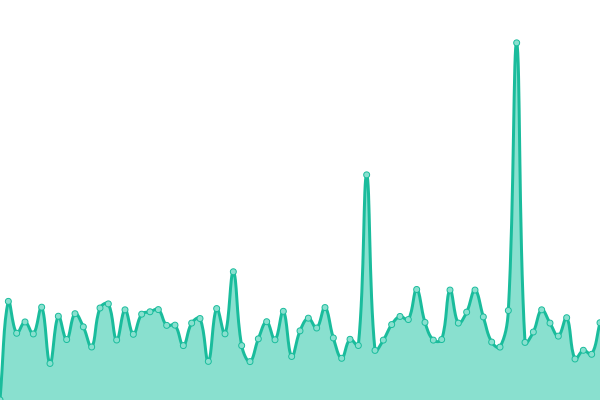
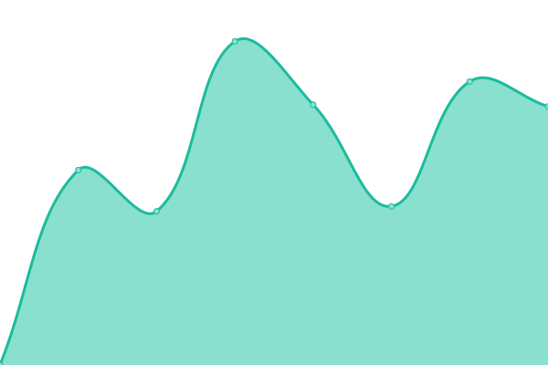

# [📈 Live Status](https://janparkio.github.io/uptime): <!--live status--> **🟧 Partial outage**

This repository contains the open-source uptime monitor and status page for [Jan Park](parkjan.com), powered by [Upptime](https://github.com/upptime/upptime).

With [Upptime](https://upptime.js.org), you can get your own unlimited and free uptime monitor and status page, powered entirely by a GitHub repository. We use [Issues](https://github.com/janparkio/uptime/issues) as incident reports, [Actions](https://github.com/janparkio/uptime/actions) as uptime monitors, and [Pages](https://janparkio.github.io/uptime) for the status page.

<!--start: status pages-->
<!-- This summary is generated by Upptime (https://github.com/upptime/upptime) -->
<!-- Do not edit this manually, your changes will be overwritten -->
<!-- prettier-ignore -->
| URL | Status | History | Response Time | Uptime |
| --- | ------ | ------- | ------------- | ------ |
|  [TIVE](https://tive.com.py/) | 🟥 Down | [tive.yml](https://github.com/janparkio/uptime/commits/HEAD/history/tive.yml) | 

 0ms
     
 | 

<a href="https://janparkio.github.io/uptime/history/tive">0.00%</a>
    

|  [Creative Park](https://creativepark.com.py/) | 🟥 Down | [creative-park.yml](https://github.com/janparkio/uptime/commits/HEAD/history/creative-park.yml) | 

 327ms
     
 | 

<a href="https://janparkio.github.io/uptime/history/creative-park">0.00%</a>
    

|  [TUPI](https://tupi.com.py/) | 🟩 Up | [tupi.yml](https://github.com/janparkio/uptime/commits/HEAD/history/tupi.yml) | 

 3927ms
     
 | 

<a href="https://janparkio.github.io/uptime/history/tupi">71.00%</a>
    

|  [Nutrihuevos](https://nutrihuevos.com.py/) | 🟩 Up | [nutrihuevos.yml](https://github.com/janparkio/uptime/commits/HEAD/history/nutrihuevos.yml) | 

 649ms
     
 | 

<a href="https://janparkio.github.io/uptime/history/nutrihuevos">77.20%</a>
    

|  [YWAM Asunción](https://ywamasuncion.com/) | 🟩 Up | [ywam-asuncion.yml](https://github.com/janparkio/uptime/commits/HEAD/history/ywam-asuncion.yml) | 

 1193ms
     
 | 

<a href="https://janparkio.github.io/uptime/history/ywam-asuncion">100.00%</a>
    

|  [TAVA](https://tava.com.py/) | 🟩 Up | [tava.yml](https://github.com/janparkio/uptime/commits/HEAD/history/tava.yml) | 

 419ms
     
 | 

<a href="https://janparkio.github.io/uptime/history/tava">100.00%</a>
    

|  [Finefoods](https://finefoods.com.py/) | 🟩 Up | [finefoods.yml](https://github.com/janparkio/uptime/commits/HEAD/history/finefoods.yml) | 

 1688ms
     
 | 

<a href="https://janparkio.github.io/uptime/history/finefoods">100.00%</a>
    

|  [Kimchi Club](https://kimchiclub.com.py/) | 🟩 Up | [kimchi-club.yml](https://github.com/janparkio/uptime/commits/HEAD/history/kimchi-club.yml) | 

 319ms
     
 | 

<a href="https://janparkio.github.io/uptime/history/kimchi-club">100.00%</a>
    

|  [Organitec](https://organitec.com.py/) | 🟩 Up | [organitec.yml](https://github.com/janparkio/uptime/commits/HEAD/history/organitec.yml) | 

 526ms
     
 | 

<a href="https://janparkio.github.io/uptime/history/organitec">100.00%</a>
    

|  [Gracia & Verdad](https://gyvpy.com/) | 🟥 Down | [gracia-and-verdad.yml](https://github.com/janparkio/uptime/commits/HEAD/history/gracia-and-verdad.yml) | 

 0ms
     
 | 

<a href="https://janparkio.github.io/uptime/history/gracia-and-verdad">0.00%</a>
    

|  [Restaurant Piroschka](https://restaurantpiroschka.com/) | 🟥 Down | [restaurant-piroschka.yml](https://github.com/janparkio/uptime/commits/HEAD/history/restaurant-piroschka.yml) | 

 213ms
     
 | 

<a href="https://janparkio.github.io/uptime/history/restaurant-piroschka">0.00%</a>
    

|  [Hotel Westfalenhaus](https://westfalenhaus.com/) | 🟩 Up | [hotel-westfalenhaus.yml](https://github.com/janparkio/uptime/commits/HEAD/history/hotel-westfalenhaus.yml) | 

 3512ms
     
 | 

<a href="https://janparkio.github.io/uptime/history/hotel-westfalenhaus">100.00%</a>
    

<!--end: status pages-->

[**Visit our status website →**](https://janparkio.github.io/uptime)

## 📄 License

- Powered by: [Upptime](https://github.com/upptime/upptime)
- Code: [MIT](./LICENSE) © [Jan Park](parkjan.com)
- Data in the `./history` directory: [Open Database License](https://opendatacommons.org/licenses/odbl/1-0/)
